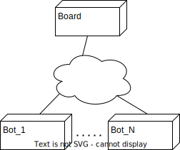
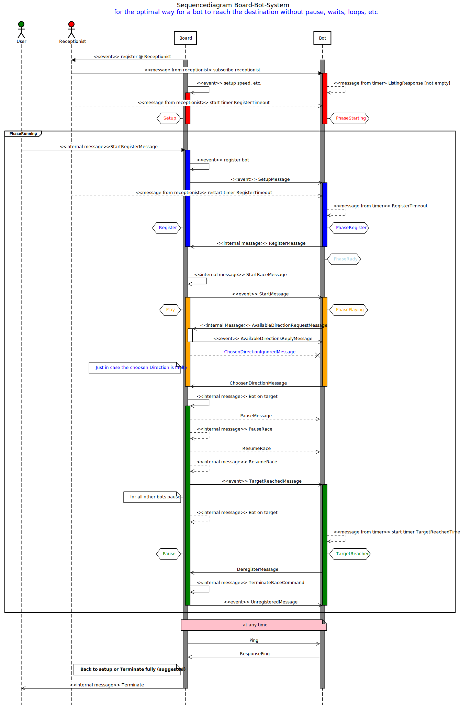
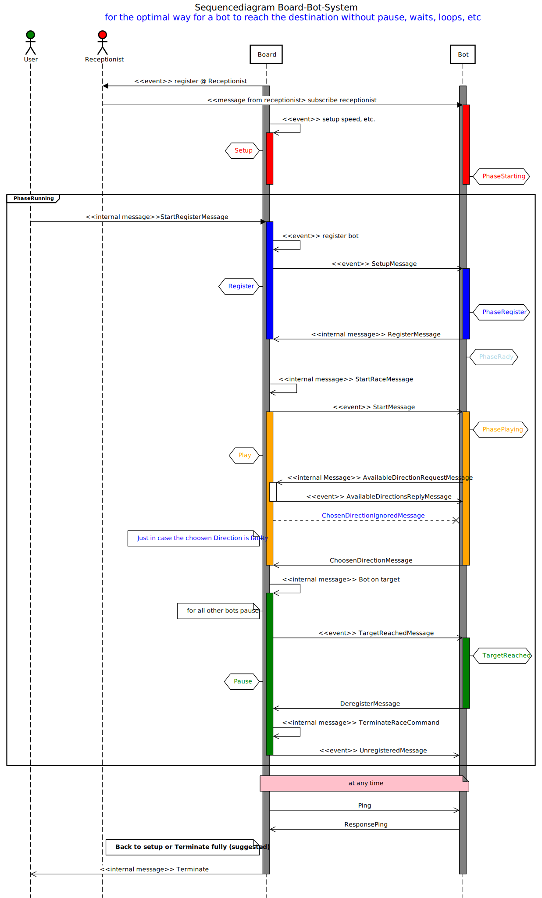

# Bot-Race Actor System

## Description

This the Bot-Race actor system.
Both, the board, and several bots can
be executed as separate Java programs (JVM instances)
on the same machine without changes in the configuration.

If run on separate machines, however, the
`application.conf` files must be adjusted accordingly.



> **Note:** The execution of the Bot-Race actor system
> on separate machines requires the modification of the
> `application.conf` files in sub-modules `board`
> and `bot`. Special care must be taken
> the machines are in different subnets or it NAT
> is in place. See the Akka documentation how to handle
> these cases.

The set of actor systems forms a so-called cluster of
actor systems, see the Akka documentation. Message
exchange uses JSON which is transparent to the
programmers of these actor systems.

## The Board Actor System

The Board actor system denotes the board of the complete
system, board and bots.

The board maintains a set of phases:


## The Bot Actor System

Several Bot actor systems can be started separately.
The bots interact with the board. See
[common/Readme](common/Readme.md) for the messages between
the board and the bots.

> **Note:** It is also possible to program
> several bots in one Bot actor system, however.

A bot maintains a set of phases, too:


## Sequencediagram

The sequencediagram below shows the interaction. One with the loops, waits and interrupts.
The one below shows the full interaction with everything.

> **Note** It has been suggested to terminate at the end when the target is found instead of restart via setup phase.




## Configuration

In order to run the Bot-Race actor system on
different machines, you must configure
the Board and the Bot actor system
accordingly. Here, the initial
configuration files are given.

### Configuration of the Board Actor System

The given `application.conf` configuration
file for the Board actor system looks like:

```code
#
# Configuration file for the Board actor system.
#
hostname = "localhost" # alternatively, you may specify 127.0.0.1 to denote 'localhost'
#hostname = "192.168.1.123" # example of a private network address behind a NAT
#hostname = "172.28.5.134" # example of a private BFH network address
port = 25511

seed-node = "akka://ClusterSystem@"${hostname}":"${port}

akka {
  log-config-on-start = "off"
  loglevel = "info"
  # log-dead-letters: "ON" | "OFF" (if "ON" then report the reception of unhandled messages)
  log-dead-letters = "OFF"

  actor {
    # provider=remote is possible, but prefer cluster
    provider = cluster
  }

  remote.artery { # mechanism to be used (Akka supports several mechanism, this one is recommended)
    canonical {
      hostname = ${hostname} # host name or IP address passed to remote systems in order to identify this system
      port = ${port}
    }
  }

  cluster {
    seed-nodes = [${seed-node}]
    downing-provider-class = "akka.cluster.sbr.SplitBrainResolverProvider"
  }
}
```

#### Notes:

- Replace loop-back addresses `127.0.0.1` by a network address if
  the Bot-Race Actor system is deployed on different machines.
- Substitute the port number with another one if `25511` is already in use.

### Configuration of the Bot Actor System

The given `application.conf` configuration
file for the Bot actor system looks like:

```code
#
# Configuration file for the Bot actor system.
#
hostname = "localhost" # alternatively, specify '127.0.0.1' to denote 'localhost'
#hostname = "192.168.1.123" # example of a private network address behind a NAT
#hostname = "172.28.5.134" # example of a private BFH network address
port = 0 # '0' means any available port

seed-host = "localhost"
#seed-host = "192.168.1.123"
#seed-host = "172.28.5.134"
seed-port = 25511
seed-node = "akka://ClusterSystem@"${seed-host}":"${seed-port}

akka {
  log-config-on-start = "off"
  loglevel = "info"

  actor {
    # provider=remote is possible, but prefer cluster
    provider = cluster
  }

  remote.artery {
    canonical {
      hostname = ${hostname}
      port = ${port}
    }
  }

  cluster {
    seed-nodes = [${seed-node}]
    downing-provider-class = "akka.cluster.sbr.SplitBrainResolverProvider"
  }
}
```

#### Notes:

- Replace loop-back addresses `127.0.0.1` by a network address if
  the Bot-Race actor system is deployed on different machines.
- `port = 0`denotes that a Bot actor system uses a free available port.
- The port number must match the one of the Board actor system, here `25511`.

## Common: The Exchange of Messages between Bots and Board

Common to all is a small library which defines the interface between the Board
and Bot actor system. It is compiled separately
into a separate Maven artifact.

For the documentation of a list of message exchanges,
see Common's
[Readme.md](common/Readme.md)
file.

Both, the Board and Bot actor systems depend
on the Common library.

Configuration of Common:

```code
#
# Specification of the serialization format of messages for the Bot-Race actor system.
#
akka {
  actor {
    serialization-bindings {
      "ch.bfh.akka.botrace.common.CborSerializable" = jackson-cbor
    }
  }
}
```

#### Notes:

- No changes needed here unless you use a different kind of serialization.
- `ch.bfh.akka.botrace.common.CborSerializable` and `jackson-cbor` are
  responsible for the use of
  [CBOR](https://en.wikipedia.org/wiki/CBOR)
  serialization.
- Akka provides also other serialization/deserialization methods.


## Import into your favorite IDE

This is a Maven multimodule project. Just import the root project (use 'Open...' in IntelliJ,
use 'Import...' -> 'Existing Maven Project' in Eclipse); the submodules will automatically
be imported as well.

## Compilation and Installation with Maven

Assuming you have the Maven command
available in your terminal,
to compile and install the application, type in the root
of this multimodule project:

```console
mvn clean install
```

Output:

```
-- a lot of output --
[INFO] ------------------------------------------------------------------------
[INFO] Reactor Summary for Bot-Race Actor System 1.0:
[INFO] 
[INFO] Common: The Bot-Race Interface ..................... SUCCESS [  1.573 s]
[INFO] Bot-Race Actor System .............................. SUCCESS [  0.009 s]
[INFO] Bot-Race Board ..................................... SUCCESS [  2.221 s]
[INFO] Bot-Race Java Bots ................................. SUCCESS [  0.325 s]
[INFO] ------------------------------------------------------------------------
[[INFO] BUILD SUCCESS
[INFO] ------------------------------------------------------------------------
[INFO] Total time:  5.724 s
[INFO] Finished at: 2023-10-05T14:59:09+02:00
[INFO] ------------------------------------------------------------------------
```

Notes:

- You can ignore the message `[WARNING] Can't extract module...`;
  it originates from a bad choice of a JAR file name of a Scala component.
- You **must** *install* (at least) the `Common` library. Otherwise,
neither the `Board` nor the `Bot` can be started via the
Maven commands as described in the respectiv Readme files
mentioned below.


## Execution of the Board

To execute the Board actor system,
see the [board/Readme](board/Readme.md) file
of the Board actor system.

The Board can also be executed via your favorite IDE.

## Execution of the Bot

To execute the Bot actor system,
see the [bot/Readme](bot/Readme.md) file
of the Bot actor system.

The Bot can also be executed via your favorite IDE.

## Javadoc

To generate the Javadoc API documentation, type:

```console
mvn clean compile javadoc:aggregate
```

This generates the top-level `index.html` file in `target/site/apidocs`.
