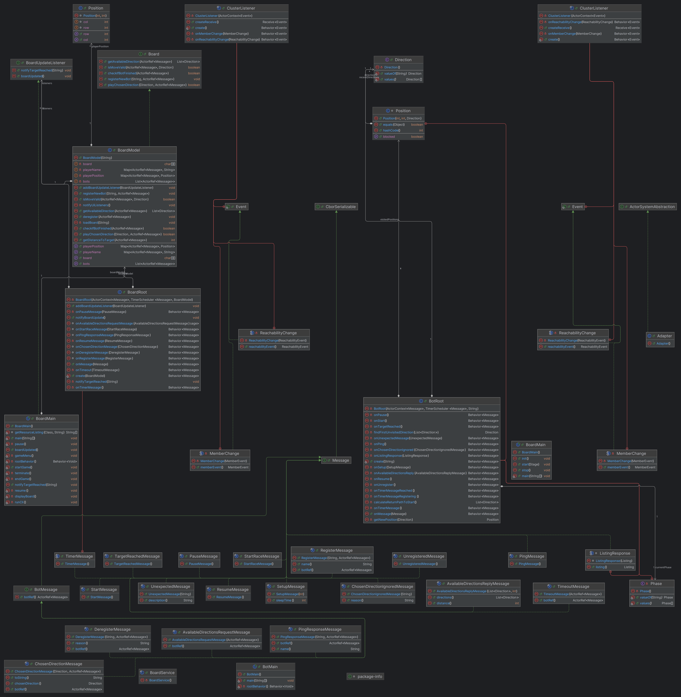
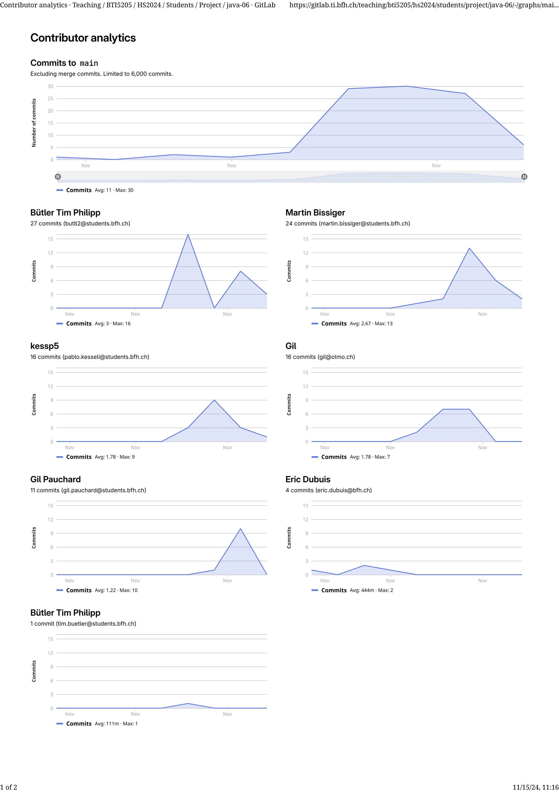

# Documentation (yet a Template)

> **Disclaimer:** This documentation might have been enhanced and grammar checked with chatGPT and deepl.

## Introduction

The Bot-Race Actor system is a distributed system that simulates a race between bots on a board. The role of the board
is to provide the game environment, including obstacles and the target that the bots must navigate to. The bots have
limited information about the board and communicate with the board to get information about available directions and the
chosen direction.

An example of a board layout could be a rectangular grid with obstacles represented by walls or barriers. The starting
point for the bots could be at one end of the grid, and the target could be at the other end. The bots must navigate
through the grid, avoiding obstacles and reaching the target.

\
The phases of the board when playing the game are:

- **Setup Phase:**\
  The board is set up with the initial configuration, including the layout of obstacles and the starting
  and target positions.

- **Playing Phase:**\
  The bots start the race, and they communicate with the board to get information about available
  directions and the chosen direction. They move one step at a time, and the board updates their positions accordingly.

- **Pause Phase:**\
  The board can pause the race at any time, for example, if a bot reaches a specific position or if a
  certain condition is met.

- **Resume Phase:**\
  The race can be resumed after being paused, allowing the bots to continue their movement.

- **Termination Phase:** \
  The race is terminated when all bots have reached the target or when a specific condition is met,
  such as a certain time limit or a specific number of steps taken.

**Akka**\
The basic principle of Akka is to build distributed systems using actors, which are lightweight, isolated, and
independent units of execution. Akka provides a message-passing model where actors communicate with each other by
sending messages. Actors are resilient to failures and can be scaled horizontally by adding more actors. The Bot-Race
Actor system utilizes Akka to implement the distributed behavior of the bots and the board.

## Document the Bot / Board Interaction

### Interaction between a Bot and the Board

In the happy case, the bot registers with the board, receives the setup information, and then requests available
directions to move. The board responds with the available directions, and the bot moves to a new position. This process
continues until the bot reaches the target, at which point the board sends a termination message to the bot.

#### Error Cases

- **Unknown Message:** If the bot sends an unknown message to the board, the board will respond with an error message,
  and
  the
  bot will not be able to continue playing.

- **Timeout:** If the bot does not respond to the board's messages within a certain time limit, the board will assume
  that
  the
  bot has timed out and will terminate the game.

### Sequencediagram without interrupts


### Sequencediagram wih interrupts


## The Design of the Board Actor System

### Classdiagram *(Generated by IntelliJ IDEA)*



### States of the Board Actor System

The board actor system has the following states:

- `Setup`: The state when the board is being set up. The board is configured and the obstacles and target positions
  are set. The board is not yet ready to receive messages from the bots.

- `Register`: The state when the board is ready to receive messages from the bots. The board is listening for register
  messages from the bots.

- `Play`: The state when the race is ongoing. The board is receiving messages from the bots and updating their
  positions accordingly.

- `Pause`: The state when the race is paused. The board is not receiving messages from the bots and is not updating
  their positions. The race can be resumed at any time.

## The Design of the Bot Actor System

The bot actor system is designed to handle the behavior of the bots in the Bot-Race actor system. It consists of several
actors, each representing a bot.

### Classes in the Bot Actor System

- `BotRoot`: Represents the root actor of the bot actor system.
- `ClusterListener`: Listens to cluster events and handles the registration and deregistration of bots.
- `BotMain`: The main actor of the bot actor system. It handles the main behavior of the bot. It receives the setup
  message from the board actor system and starts the race. It also handles the movement of the bot and the handling of
  obstacles.

### States of the Bot Actor System

The bot actor system has the following states:

- `PhaseStarting`: The state when the bot is initializing and preparing to register with the board actor system.

- `PhaseRegister`: The state when the bot is registering with the board actor system. The bot is waiting for the board
  to
  respond with a setup message.

- `PhaseReady`: The state when the bot is ready to start the race. The bot is waiting for the board to start the race.

- `PhasePlaying`: The state when the bot is playing the race. The bot is sending messages to the board to request
  available directions and move to a new position.

- `TargetReached`: The state when the bot has reached the target position. The bot starts a timer and after a certain
  duration the bot will Deregister itself from the board.

### Termination of the Bot Actor System

The bot actor system terminates when all the bot actors have terminated. This can happen for several reasons:

- All the bots have reached the target position.
- All the bots have been deregistered.
- The board actor system has terminated.

When the bot actor system terminates, it sends a message to the board actor system to inform it of the termination.

## The Algorithms of the Bots

The bot uses a randomized path selection algorithm to navigate a grid and reach a target position. At each move, it
queries the possible directions it can go from the current position and randomly picks one direction from this set. The
bot’s path selection logic is straightforward but not optimal, as it lacks memory of past positions or awareness of
dead-ends, which makes it susceptible to revisiting the same points repeatedly or getting stuck in loops.

Here's an example of a pseudocode for the bot's algorithm:

```pseudocode
function playGame() {
    initializeBot();
    while (true) {
        switch (currentPhase) {
            case REGISTERING:
                registerWithBoard();
                waitForGameToStart();
                break;

            case READY:
                waitForAvailableDirections();
                break;

            case PLAYING:
                chooseDirection();
                sendChosenDirectionToBoard();
                checkIfMoveIgnored();
                checkIfTargetReached();
                break;

            case PAUSED:
                waitForResumeMessageFromBoard();
                break;

            case TARGET_REACHED:
                deregisterWithBoard();
                return;  // Spiel endet, wenn das Ziel erreicht ist
        }
    }
}

// Phase: REGISTERING
function registerWithBoard() {
    // Send registration message to the board
    print("Registering bot with the board");
}

function waitForGameToStart() {
    // Wait until the start message is received
    print("Waiting for game to start...");
}

// Phase: READY
function waitForAvailableDirections() {
    // Request available directions from the board and wait for response
    print("Requesting available directions from the board");
}

// Phase: PLAYING
function chooseDirection() {
    availableDirections = getAvailableDirections();  // Retrieve from board message
    if (availableDirections.isEmpty()) {
        print("No directions available");
        return;
    }
    
    // **Simple Strategy for Pathfinding**:
    // 1. Evaluate each direction:
    //    - If moving closer to the target, prioritize it.
    //    - If not closer, deprioritize.
    // 2. Choose the first best direction; fallback to random if blocked.
    
    bestDirection = null;
    minDistanceToTarget = calculateDistanceToTarget(currentPosition);
    
    // Evaluate all directions to find the best one
    for each direction in availableDirections {
        newPosition = calculateNewPosition(currentPosition, direction);
        distanceToTarget = calculateDistanceToTarget(newPosition);
        
        if (distanceToTarget < minDistanceToTarget) {
            minDistanceToTarget = distanceToTarget;
            bestDirection = direction;
        }
    }

    // If a closer direction is found, choose it; otherwise, pick a random direction
    chosenDirection = bestDirection != null ? bestDirection : chooseRandomDirection(availableDirections);
}

function sendChosenDirectionToBoard() {
    // Send the chosen direction to the board
    print("Sending chosen direction to board:", chosenDirection);
}

function checkIfMoveIgnored() {
    // If the move is ignored, request available directions again
    if (moveWasIgnored()) {
        print("Chosen direction was ignored. Re-requesting directions");
        waitForAvailableDirections();
    }
}

function checkIfTargetReached() {
    // Check if the bot has reached the target position
    if (currentPosition == targetPosition) {
        currentPhase = TARGET_REACHED;
        print("Target reached!");
    }
}

// Phase: PAUSED
function waitForResumeMessageFromBoard() {
    // Wait for a resume message to continue playing
    print("Game paused. Waiting to resume...");
}

// Phase: TARGET_REACHED
function deregisterWithBoard() {
    // Send deregistration message to the board
    print("Deregistering bot from the board");
}

// **Helper Functions**:
function calculateNewPosition(currentPosition, direction) {
    // Calculate new position based on direction
    return newPosition;
}

function calculateDistanceToTarget(position) {
    // Calculate distance from the given position to the target
    return distance;
}

function chooseRandomDirection(availableDirections) {
    // Choose a random direction from available options
    return randomDirection;
}

function moveWasIgnored() {
    // Check if the move was ignored based on board response
    return trueOrFalse;
}

function initializeBot() {
    // Set initial values for bot
    currentPhase = REGISTERING;
    currentPosition = (0, 0);
    moveCount = 0;
    recentDirections = [];
}
```

This is a simplified example, and the actual implementation may vary based on the specific requirements and design
decisions of your bot.

## Administrative Issues

**Gil**\
In this project, I learned and applied the fundamentals of the message exchange system of the Akka framework.
I started working on the BoardModel and BoardRoot class, which was fun to implement the handling of the incoming
messages, updating the states of the current Board and sending messages back to the Bot.
I got more familiar with using Git with multiple teammembers and had first experience with branches, merges and so on.
The task-splitting in the group was well organised, but if your class depend on another logic, good communication is
needed to merge the different implementations.
On thursday I also tried working on the bot's algorithm.
For me this was the hardest task and there could have been a bit more guidance (but since there is a price to win for
the best algorithm, I see why there is less description on the problem).
But in general the project was a good experience :)

**Martin**\
I've focused on enhancing bot functionality and user interface interactions in a bot application. My key tasks included:

Improving Bot Responsiveness: I fixed bot handling by setting appropriate timeouts and added new features like ping
board functionality.
Enhancing User Interaction: I implemented features that allow users to start races on demand and select resources via a
CLI, making the application more interactive.
Integrating Akka Framework: I worked with the Akka framework to facilitate message events between actors and the CLI,
which enhanced the application's scalability and responsiveness.

Challenges and Learnings
Timeout Management: One significant challenge was managing timeouts for bots, which I initially missed but later fixed
to enhance bot efficiency.
Branch Merges and Conflicts: Merging changes and resolving conflicts were tough but essential for maintaining code
integrity and functionality.
Advanced Logging: Shifting from standard output to file-based logging helped in debugging and keeping the UI
interactions smooth.
These experiences improved my skills in managing complex software functionalities and deepened my understanding of
user-centric design and efficient code management.
GUI Implementation Attempt: I tried to implement a GUI using FXML but had to abandon this approach due to time
constraints and the complexity of the concept.

**Pablo**\
In this project, I was able to expand my akka knowledge by implementing a lot of message handling. I was also confronted
with a lot of logging and error handling. My newly gained knowledge in akka contains working with a receptionist and
working with timers. I also gained experience working in a group and creating concepts of algorithms. In addition to all
of this I was able to learn new git cli commands and I was also confronted with more complex version control problems
like merge requests and various branches being developed simultaneously.

**Tim**\
Using Git and GitHub for version control was a new and valuable experience for me. I learned to manage branches, submit
pull requests, and resolve merge conflicts, which improved my workflow. I also took on part of the GUI design for this
project, which presented a unique challenge. Some troubles appeared as I tried to use the FXMLLoader. However, this
experience
taught me a lot about UI design principles and integration with backend systems.

### Contributor analytics


